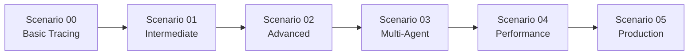

# Getting Started Guide

> Step-by-step introduction to the AI tracing scenarios

## Welcome! 👋

This guide will walk you through everything you need to know to successfully complete the AI tracing scenarios. Whether you're a beginner or have some experience with AI development, this guide will ensure you're ready to make the most of this learning experience.

## What to Expect 📋

### Time Commitment
- **Total Study Time**: 2-3 hours
- **Per Scenario**: 15-40 minutes
- **Setup Time**: 10-15 minutes

### Learning Path
1. **Setup** (10-15 min) → Environment preparation
2. **Scenario 00** (15-20 min) → Basic tracing concepts
3. **Scenario 01** (20-25 min) → Intermediate patterns
4. **Scenario 02** (25-30 min) → Advanced tracing
5. **Scenario 03** (30-35 min) → Multi-agent systems
6. **Scenario 04** (25-30 min) → Performance monitoring
7. **Scenario 05** (30-40 min) → Production-ready tracing

## Prerequisites Check ✅

Before starting, make sure you have:

### Required Software
- [ ] **Python 3.8+** - [Download here](https://python.org)
- [ ] **Git** - [Download here](https://git-scm.com)
- [ ] **Text Editor/IDE** - VS Code recommended

### Required Accounts
- [ ] **GitHub Account** - [Sign up here](https://github.com)
- [ ] **GitHub Models Access** - [Access here](https://github.com/marketplace/models)

### Knowledge Prerequisites
- [ ] **Basic Python** - Variables, functions, imports
- [ ] **Command Line** - Basic terminal/command prompt usage
- [ ] **Git Basics** - Clone, checkout, status commands

### Verification Commands

Run these commands to verify your setup:

<!-- tabs:start -->

#### **Windows (PowerShell)**

```powershell
# Check Python version (should be 3.8+)
python --version

# Check Git installation
git --version

# Check pip is available
pip --version
```

#### **macOS/Linux (Terminal)**

```bash
# Check Python version (should be 3.8+)
python3 --version

# Check Git installation
git --version

# Check pip is available
pip3 --version
```

<!-- tabs:end -->

## Setup Overview 🛠️

The setup process involves:

1. **Repository Setup** - Clone and prepare the codebase
2. **Python Environment** - Create isolated environment
3. **Dependencies** - Install required packages
4. **API Configuration** - Set up GitHub Models access
5. **Verification** - Test everything works

### Quick Setup (Experienced Users)

```bash
git clone https://github.com/therealjohn/ai-agent-tracing-scenarios.git
cd ai-agent-tracing-scenarios
python -m venv .venv
.venv\Scripts\activate  # Windows
source .venv/bin/activate  # macOS/Linux
pip install -r requirements.txt
# Configure .env file with your GitHub token
git checkout scenario_00
```

### Detailed Setup (Step-by-Step)

👉 **[Follow the detailed setup instructions](setup.md)**

## Study Structure 📚

### Scenario Progression

Each scenario builds on the previous one:



### Learning Approach

For each scenario, you'll:

1. **Read the Overview** - Understand the goals and concepts
2. **Review the Code** - Examine the provided implementation
3. **Run the Scenario** - Execute and observe the behavior
4. **Experiment** - Try modifications and see the effects
5. **Reflect** - Consider the tracing insights gained

## Branch Navigation 🌳

This repository uses Git branches to isolate each scenario:

### Branch Structure
- **`main`** - Contains setup files and this documentation
- **`scenario_00`** - Basic tracing (no shared utilities)
- **`scenario_01-05`** - Progressive scenarios (with shared utilities)
- **`docs`** - This documentation site

### Switching Between Scenarios

```bash
# Check current branch
git branch

# Switch to a scenario
git checkout scenario_01

# Verify you're on the correct branch
git status

# List files in current scenario
ls  # or dir on Windows
```

## Working with Scenarios 🔄

### Typical Workflow

1. **Checkout the scenario branch**
   ```bash
   git checkout scenario_XX
   ```

2. **Read the scenario-specific instructions**
   ```bash
   # View in terminal
   cat README_scenario_XX.md
   
   # Or open in your editor
   code README_scenario_XX.md
   ```

3. **Activate your virtual environment**
   ```bash
   # Windows
   .venv\Scripts\activate
   
   # macOS/Linux
   source .venv/bin/activate
   ```

4. **Run the scenario**
   ```bash
   python main.py
   ```

5. **Experiment and learn**
   - Modify the code
   - Run it again
   - Observe the changes in tracing output

## Tips for Success 💡

### General Tips
- **Take Notes**: Keep track of insights and questions
- **Experiment**: Don't just run the code - modify it!
- **Ask Questions**: Use the troubleshooting guide if stuck
- **Take Breaks**: Each scenario is self-contained

### Technical Tips
- **Use Virtual Environments**: Prevents dependency conflicts
- **Check Your Branch**: Always verify with `git branch`
- **Read Error Messages**: They often contain helpful information
- **Keep Backups**: Git makes this easy with branches

### Learning Tips
- **Connect Concepts**: Relate new concepts to previous scenarios
- **Real-world Thinking**: Consider how you'd use this in your projects
- **Share Insights**: Discuss with colleagues or study partners

## Common Gotchas 🚨

### Environment Issues
- **Wrong Python Version**: Ensure you're using Python 3.8+
- **Virtual Environment**: Always activate before running scenarios
- **Dependencies**: Run `pip install -r requirements.txt` if imports fail

### Git Issues
- **Wrong Branch**: Check with `git branch` and switch if needed
- **File Not Found**: Ensure you're in the correct directory
- **Uncommitted Changes**: Stash or commit before switching branches

### API Issues
- **Missing Token**: Ensure `.env` file is configured
- **Invalid Token**: Regenerate if expired
- **Rate Limits**: Wait a moment if you hit API limits

## Need Help? 🆘

### Resources Available
- **[Troubleshooting Guide](troubleshooting.md)** - Common issues and solutions
- **[Additional Resources](resources.md)** - Links and references
- **Scenario READMEs** - Specific instructions for each scenario

### Getting Unstuck
1. **Check the Basics**: Right branch? Environment activated? Files present?
2. **Read Error Messages**: They often tell you exactly what's wrong
3. **Consult Documentation**: Each scenario has detailed instructions
4. **Start Fresh**: Sometimes a clean checkout helps

---

## Ready to Begin? 🚀

Now you're prepared to start your AI tracing journey!

👉 **[Complete the Setup](setup.md)** if you haven't already

👉 **[Start with Scenario 00](scenarios/scenario-00.md)** to begin learning

👉 **[View All Scenarios](scenarios/overview.md)** to see what's ahead