# Scenario Overview

> Complete guide to all 6 AI tracing scenarios

## Learning Path 🎯

The scenarios are designed as a progressive learning journey, each building on concepts from the previous ones. Here's your roadmap:

```mermaid
graph TD
    A[Setup Complete ✅] --> B[Scenario 00: Basic Tracing]
    B --> C[Scenario 01: Intermediate Patterns]
    C --> D[Scenario 02: Advanced Tracing]
    D --> E[Scenario 03: Multi-Agent Systems]
    E --> F[Scenario 04: Performance Monitoring]
    F --> G[Scenario 05: Production Ready]
    G --> H[Complete! 🎉]
```



## Scenario Details 📚

### [Scenario 00: Basic Tracing Setup](scenario-00.md)
**Difficulty**: Beginner | **Time**: 15-20 minutes

Learn the fundamentals of AI tracing with a simple, single-function setup.

**What You'll Learn**:
- Basic tracing concepts and terminology
- Simple trace implementation
- Understanding trace output and structure
- Foundation for all other scenarios

**Key Concepts**:
- Span creation and management
- Basic attributes and metadata
- Trace visualization basics

---

### [Scenario 01: Intermediate Tracing](scenario-01.md)
**Difficulty**: Beginner+ | **Time**: 20-25 minutes

Expand your tracing to multi-function workflows with shared utilities.

**What You'll Learn**:
- Multi-function tracing patterns
- Shared tracing utilities
- Trace context propagation
- Error handling in traces

**Key Concepts**:
- Trace context management
- Nested spans and hierarchies
- Shared tracing libraries

---

### [Scenario 02: Advanced Tracing Patterns](scenario-02.md)
**Difficulty**: Intermediate | **Time**: 25-30 minutes

Implement sophisticated tracing patterns for complex AI workflows.

**What You'll Learn**:
- Advanced span relationships
- Custom attributes and metadata
- Conditional tracing logic
- Best practices for production code

**Key Concepts**:
- Advanced span management
- Custom instrumentation
- Performance-conscious tracing

---

### [Scenario 03: Multi-Agent Systems](scenario-03.md)
**Difficulty**: Intermediate+ | **Time**: 30-35 minutes

Trace interactions between multiple AI agents in a coordinated system.

**What You'll Learn**:
- Multi-agent trace coordination
- Cross-agent context propagation
- Agent interaction patterns
- Distributed tracing concepts

**Key Concepts**:
- Distributed tracing
- Agent-to-agent communication
- Cross-service trace correlation

---

### [Scenario 04: Performance Monitoring](scenario-04.md)
**Difficulty**: Advanced | **Time**: 25-30 minutes

Focus on performance metrics, monitoring, and optimization through tracing.

**What You'll Learn**:
- Performance metric collection
- Resource usage tracking
- Cost monitoring and optimization
- Performance bottleneck identification

**Key Concepts**:
- Performance instrumentation
- Resource monitoring
- Cost tracking and analysis

---

### [Scenario 05: Production-Ready Tracing](scenario-05.md)
**Difficulty**: Advanced | **Time**: 30-40 minutes

Implement enterprise-grade tracing suitable for production environments.

**What You'll Learn**:
- Production-ready tracing architecture
- Error handling and resilience
- Configuration management
- Monitoring and alerting integration

**Key Concepts**:
- Production deployment patterns
- Error resilience
- Configuration management
- Integration with monitoring systems

## Quick Start Guide 🚀

### Prerequisites Complete?
Before starting any scenario, ensure you've completed:
- ✅ [Setup Instructions](../setup.md)
- ✅ Environment activated
- ✅ API configured

### Starting a Scenario

Each scenario follows the same pattern:

1. **Switch to the scenario branch**:
   ```bash
   git checkout scenario_XX
   ```

2. **Verify you're on the correct branch**:
   ```bash
   git branch
   # Should show: * scenario_XX
   ```

3. **Review the scenario-specific README**:
   ```bash
   cat README_scenario_XX.md
   # Or open in your editor
   ```

4. **Run the scenario**:
   ```bash
   python main.py
   ```

## Recommended Learning Path 📋

### For Beginners
Start with the complete sequence:
1. [Scenario 00](scenario-00.md) - Master the basics
2. [Scenario 01](scenario-01.md) - Build on fundamentals
3. [Scenario 02](scenario-02.md) - Learn advanced patterns
4. Continue through remaining scenarios

### For Intermediate Users
You can start with:
1. [Scenario 01](scenario-01.md) - Quick fundamentals review
2. [Scenario 02](scenario-02.md) - Advanced patterns
3. [Scenario 03](scenario-03.md) - Multi-agent systems
4. Continue with performance and production scenarios

### For Advanced Users
Focus on specific areas:
- **Multi-Agent Systems**: [Scenario 03](scenario-03.md)
- **Performance**: [Scenario 04](scenario-04.md)  
- **Production**: [Scenario 05](scenario-05.md)

## Study Tips 💡

### Before Each Scenario
- [ ] Read the scenario overview completely
- [ ] Ensure you're on the correct Git branch
- [ ] Verify your virtual environment is activated
- [ ] Review any prerequisites from previous scenarios

### During Each Scenario
- [ ] Run the code as-is first to see baseline behavior
- [ ] Read through the code to understand the implementation
- [ ] Experiment with modifications
- [ ] Take notes on insights and questions

### After Each Scenario
- [ ] Reflect on what you learned
- [ ] Consider how you'd apply this in your own projects
- [ ] Note any questions for later research
- [ ] Check that you understand the key concepts

## Time Management ⏰

### Suggested Schedule

**Option 1: Single Session (2-3 hours)**
- Setup: 15 minutes
- Scenarios 00-02: 1 hour
- Break: 15 minutes  
- Scenarios 03-05: 1.5 hours

**Option 2: Multiple Sessions**
- Session 1: Setup + Scenarios 00-01 (45 minutes)
- Session 2: Scenarios 02-03 (1 hour)
- Session 3: Scenarios 04-05 (1 hour)

**Option 3: Flexible Learning**
- Complete scenarios at your own pace
- Each scenario is self-contained
- Come back to concepts as needed

## Troubleshooting Common Issues 🔧

### Wrong Branch
```bash
# Check current branch
git branch

# Switch to correct branch
git checkout scenario_XX
```

### Missing Files
```bash
# Ensure you're in the right directory
pwd
ls

# Should see main.py and README_scenario_XX.md
```

### Import Errors
```bash
# Verify virtual environment is active
# Prompt should show (.venv)

# If not active:
source .venv/bin/activate  # macOS/Linux
.venv\Scripts\activate     # Windows
```

### API Errors
```bash
# Check environment configuration
python -c "
import os
from dotenv import load_dotenv
load_dotenv()
print('Token configured!' if os.getenv('API_CREDENTIAL_TOKEN') else 'Token missing!')
"
```

## What to Expect 🎯

### Learning Outcomes

By completing all scenarios, you'll have:

- **Foundational Knowledge**: Core tracing concepts and terminology
- **Practical Skills**: Hands-on experience implementing tracing
- **Advanced Techniques**: Sophisticated patterns for complex systems
- **Production Readiness**: Enterprise-grade tracing practices
- **Real-world Application**: Ability to apply tracing to your own projects

### Skill Progression

```
Beginner → Intermediate → Advanced → Expert
    ↓           ↓            ↓        ↓
Scenario 00  Scenario 02  Scenario 04  Your Projects!
Scenario 01  Scenario 03  Scenario 05
```

---

## Ready to Start? 🚀

Choose your starting point:

👉 **[Start with Scenario 00](scenario-00.md)** - Recommended for everyone

👉 **[Jump to Intermediate](scenario-01.md)** - If you have basic tracing knowledge

👉 **[Advanced Topics](scenario-03.md)** - If you're experienced with tracing

---

## Need Help? 🆘

- **[Troubleshooting Guide](../troubleshooting.md)** - Common issues and solutions
- **[Setup Instructions](../setup.md)** - If you need to reconfigure
- **[AI Tracing Overview](../ai-tracing-overview.md)** - Review fundamental concepts